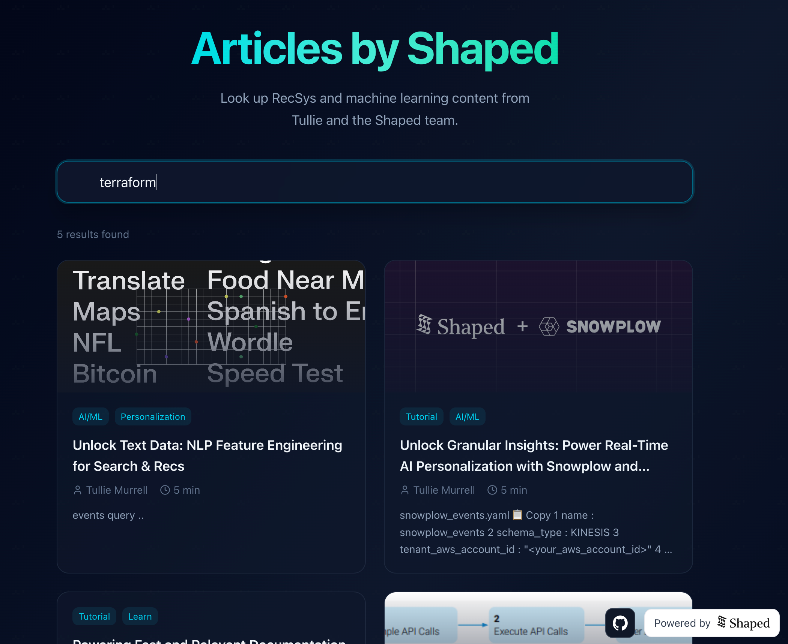
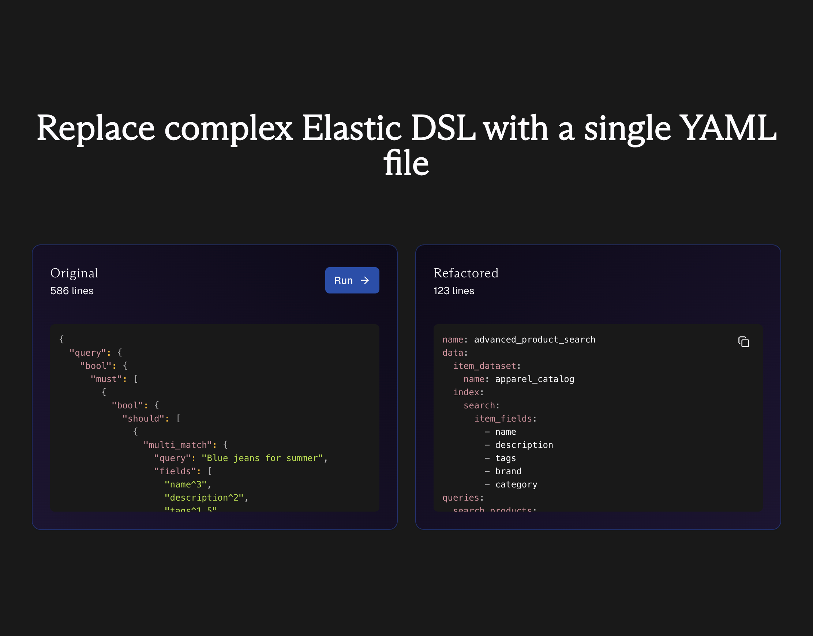
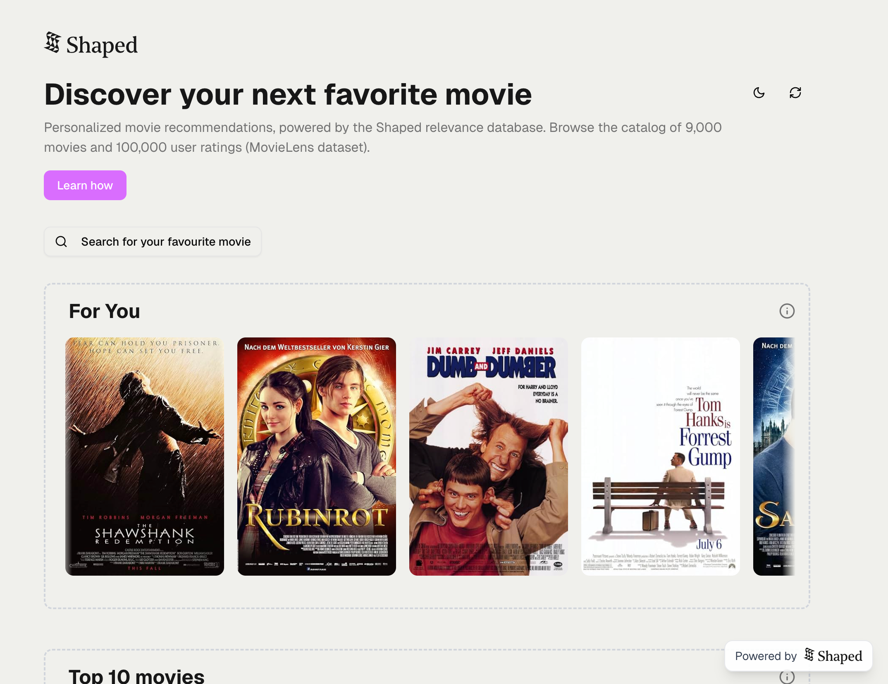

# Shaped tutorials

  These sample apps demonstrate what you can build with Shaped, and showcase different use cases and features. As reference apps, they are not intended for production, but are a great way to learn how to implement engines and queries.

Built with ❤️‍🔥 by Shaped.

<table>
<tr>
  <!-- Document Search -->
  <td width="50%" valign="top">
    <h2><a href="apps/document-search">Document Search</a></h2>
      

        Search for Recsys articles in the Shaped blog using hybrid search.
      

    <b><a href="https://shaped-blog-search.vercel.app/">Live Demo</a></b>
     
    

      
<b>📕 Description and Features</b>

      
An example that shows how to do hybrid search using Shaped. Demonstrates how to implement a sentence transformer model combined with BM25 indexes to query using text content.

      
      <b>Use Cases</b> 
      

        Search bar on a website, RAG (Retrieval-Augmented Generation) applications
      

      <b>Features</b> 
      

        <code>Hybrid Search</code>, <code>Sentence Transformers</code>, <code>BM25</code>, <code>Text Search</code>
      

    

  </td>
  <!-- Elastic to Shaped -->
  <td valign="top">
    <h2><a href="apps/elastic-to-shaped">Elastic to Shaped</a></h2>
    
Convert Elasticsearch queries into simpler Shaped queries.

    <b><a href="https://elastic-to-shaped.vercel.app">Live Demo</a></b>
     
    

      
<b>📕 Description and Features</b>

      
A migration assistant to convert Elastic queries to Shaped. Uses an LLM with context to convert Elastic DSL queries into ShapedQL, making it easy to migrate from Elasticsearch to Shaped.

      
      <b>Features</b> 
      

        <code>Query Conversion</code>, <code>LLM Integration</code>, <code>Migration Tool</code>, <code>Elastic DSL</code>
      

    

  </td>
</tr>
<tr>
  <!-- Fashion Catalog 
  <td width="50%" valign="top">
    <h2><a href="apps/fashion-catalog">Fashion Catalog</a></h2>
    
A fashion e-commerce site powered by Shaped.

     
    

      
<b>📕 Description and Features</b>

      
A catalog of fashion items demonstrating personalization and complement item recommendations. Shows how to build an e-commerce experience with personalized product recommendations based on user interactions and cart contents.

      <b>Features</b> 
      

        <code>Product Catalog</code>, <code>Personalization</code>, <code>Complement Items</code>, <code>Similar Items</code>, <code>Cart-based Recommendations</code>
      

    

  </td>
  -->
  <!-- Movie Recommendations -->
  <td valign="top">
    <h2><a href="apps/movie-recommendations">Movie Recommendations</a></h2>
    
Netflix-style content carousels with recommendations powered by Shaped.

    <b><a href="https://movies.shaped.ai">Live Demo</a></b>
     
    

      
<b>📕 Description and Features</b>

      
A complete movie recommendation system demonstrating personalized feeds, similar items, and personalization based on user interactions. Built with Next.js frontend and Shaped backend, showcasing how to retrieve personalized movie recommendations and track user interactions.

      
      <b>Features</b> 
      

        <code>Personalized Recommendations</code>, <code>Similar Items</code>, <code>User Interactions</code>, <code>MovieLens Dataset</code>, <code>Next.js</code>
      

    

  </td>
</tr>
</table>

## Notebooks

We also have a few notebooks to show basic use cases of Shaped in action. 

| Dataset                                                | Connector                                                         | GitHub Link                                                          | Colab Link                                                                                                                                                                                                     |
| ------------------------------------------------------ | ----------------------------------------------------------------- | -------------------------------------------------------------------- | -------------------------------------------------------------------------------------------------------------------------------------------------------------------------------------------------------------- |
| [Movielens](https://grouplens.org/datasets/movielens/) | [Shaped Dataset](https://docs.shaped.ai/docs/api#tag/Dataset/operation/datasets__create_dataset_post)                         | [Link](tutorials/Shaped%20Dataset%20Movielens%20Tutorial.ipynb)              |               |
| [Amazon](https://jmcauley.ucsd.edu/data/amazon/)       | [PostgreSQL](https://docs.shaped.ai/docs/integrations/postgresql) | [Link](tutorials/Postgres%20Amazon%20Beauty%20Ratings%20Tutorial.ipynb) |  |
| [Goodbooks](https://fastml.com/goodbooks-10k-a-new-dataset-for-book-recommendations/) | [MongoDB](https://docs.shaped.ai/docs/integrations/mongodb/) | [Link](tutorials/MongoDB%20Goodbooks%20Tutorial.ipynb) |  |
| [RentTheRunway](https://cseweb.ucsd.edu/~jmcauley/datasets.html#clothing_fit:~:text=%2C%202019%0Apdf-,Clothing%20Fit%20Data,-Description) | [Shaped Dataset](https://docs.shaped.ai/docs/api#tag/Dataset/operation/datasets__create_dataset_post) | [Link](tutorials/Shaped_Dataset_RentTheRunway_Turorial.ipynb) |  |
| [Steam](https://cseweb.ucsd.edu/~jmcauley/datasets.html#steam_data) | [Shaped Dataset](https://docs.shaped.ai/docs/api/#tag/Dataset/operation/datasets__create_dataset_post) | [Link](tutorials/Shaped_Steam_Review_Tutorial.ipynb) |        
